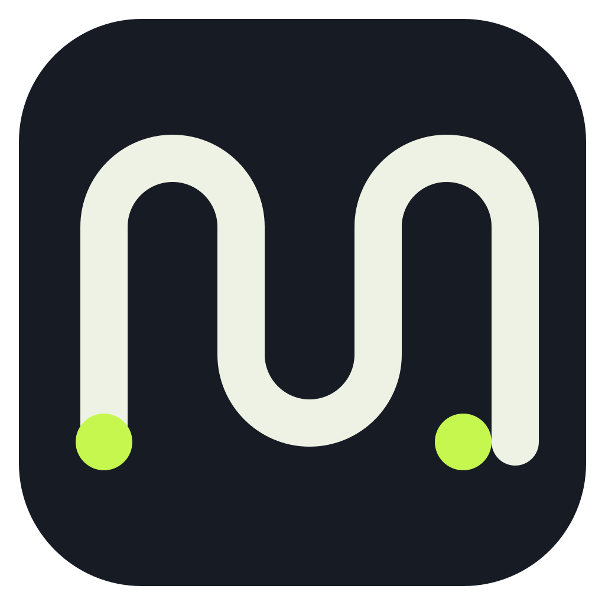
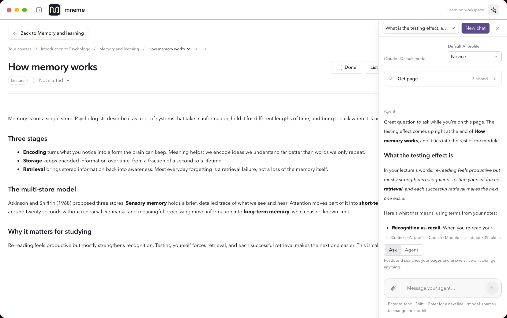
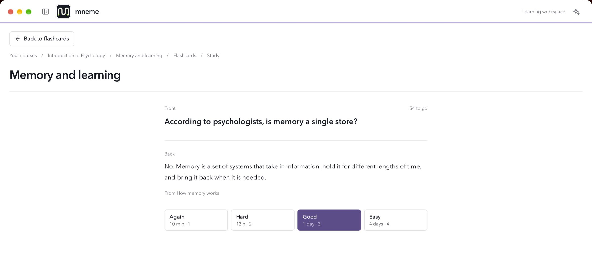
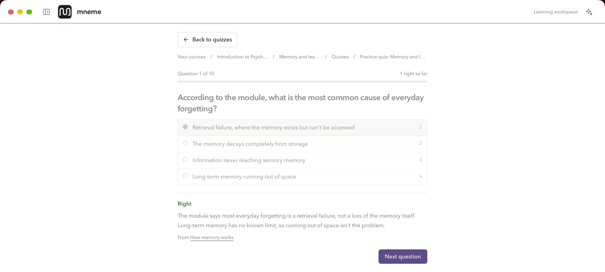
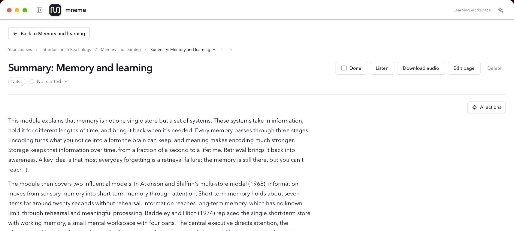
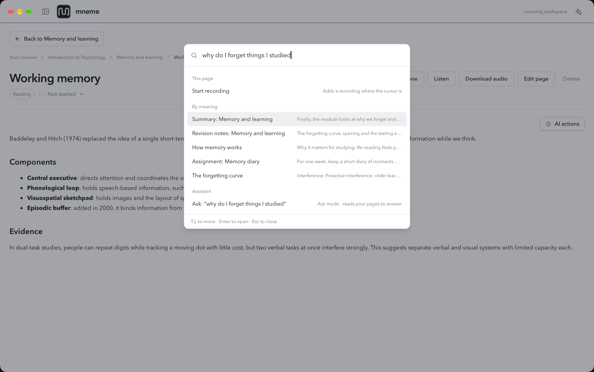

<div align="center">



<h1>mneme</h1>

<p><strong>Your course, ready to revise.</strong></p>

<p>
mneme turns course pages, files and lectures into notes, flashcards and quizzes,<br>
all on your Mac.
</p>

<p>


<a href="https://github.com/Anuboost-Long/mneme-dist/releases/latest"></a>
</p>

<p>
<a href="#features">Features</a> ·
<a href="#install">Install</a> ·
<a href="#development">Development</a> ·
<a href="#project-structure">Structure</a> ·
<a href="#documentation">Docs</a>
</p>

<br>

<picture>
  <source media="(prefers-color-scheme: dark)" srcset="website/public/screenshots/hero-dark.jpg">
  
</picture>

</div>

<br>

## Features

<table>
<tr>
<td width="50%" valign="top">

### 📥 Bring it in

- **Import anything** — PDFs, Word documents, slides, text, pictures or a link
- **Your school's pages** — sign in to your course site and import a page with its due date
- **Text from pictures** — screenshots and scans become searchable text, read on your Mac
- **Sorted for you** — each page is marked lecture, reading, assignment or exercise

</td>
<td width="50%" valign="top">

### 🎙️ Record and listen

- **Record lectures** — the room, your computer's sound, or both
- **Transcribe on your Mac** — recordings and lecture videos become editable text
- **Read aloud** — a page, a selection or a module summary, each word highlighted

</td>
</tr>
<tr>
<td valign="top">

### ✨ Ask AI

- **Ask about your notes** — answers from your own pages, showing what it read
- **Agent mode** — it makes pages, flashcards and tasks; you approve each change
- **AI actions** — summarize, explain, simplify, translate, or write your own
- **Your choice of agent** — Claude, Codex, Gemini, Copilot or Cursor

</td>
<td valign="top">

### 🧠 Revise

- **Prepare module** — summary, revision notes, flashcards and a quiz in one click
- **Flashcards** — scheduled so each card returns before you forget it
- **Quizzes** — multiple choice, true or false and short answer
- **Study mode** — summary, cards, then a quiz, ending with what to review
- **Share as PDF** — send notes or a deck by AirDrop, Messages or Mail

</td>
</tr>
<tr>
<td valign="top">

### 🔎 Find and plan

- **Search by meaning** — find the page without its exact words
- **Command palette** — any page, action or question from <kbd>⌘</kbd> <kbd>P</kbd>
- **Tasks and due dates** — found in your pages and listed by date
- **Keyboard shortcuts** — rebind common actions to keys you know

</td>
<td valign="top">

### 🔒 Private by design

- **Stored on your Mac** — no account, no cloud library
- **Backups you control** — your whole library, with its files, in one backup
- **Recently deleted** — courses, modules and pages wait 30 days before they're gone

</td>
</tr>
</table>

<div align="center">
<br>
<picture>
  <source media="(prefers-color-scheme: dark)" srcset="website/public/screenshots/flashcards-dark.jpg">
  
</picture>
<picture>
  <source media="(prefers-color-scheme: dark)" srcset="website/public/screenshots/quiz-dark.jpg">
  
</picture>
<picture>
  <source media="(prefers-color-scheme: dark)" srcset="website/public/screenshots/summary-dark.jpg">
  
</picture>
<picture>
  <source media="(prefers-color-scheme: dark)" srcset="website/public/screenshots/search-dark.jpg">
  
</picture>
</div>

<br>

## Install

Releases and the installer live in [**mneme-dist**](https://github.com/Anuboost-Long/mneme-dist). One line in Terminal:

```bash
curl -fsSL https://raw.githubusercontent.com/Anuboost-Long/mneme-dist/main/install.sh | bash
```

It picks the build for your Mac (Apple Silicon or Intel), installs it to `/Applications` and clears the quarantine flag. Prefer a disk image? Grab `mneme-arm64.dmg` or `mneme-x64.dmg` from [Releases](https://github.com/Anuboost-Long/mneme-dist/releases/latest).

<br>

## Development

mneme is a [Tauri 2](https://tauri.app) app with a React 19 + TypeScript front end. Every native capability — storage, files, recording, speech, the agent server — comes from the **Chain SDK** (`@chain/sdk`). The app never imports Tauri, Rust or OS APIs directly.

### Prerequisites

- **Node.js** and **npm**
- **Rust** and the [Tauri prerequisites](https://tauri.app/start/prerequisites/) for macOS
- The **`chain-sdk`** repository checked out next to this one:

```
Work/
├── chain-sdk/   ← @chain/sdk and @chain/cli are linked from here
└── mneme/
```

### Run it

```bash
npm install
npm run dev
```

### Scripts

| Command | What it does |
| :--- | :--- |
| `npm run dev` | Runs the native app with hot reload (`chain dev` → `tauri dev`) |
| `npm run dev:web` | Front end only, in the browser, via Vite |
| `npm run build` | Builds the native app for this Mac |
| `npm run build:mac` | Builds both Apple Silicon and Intel |
| `npm run build:web` | Typechecks and builds the front end only |
| `npm test` | Runs the test suite with Node's test runner |
| `npm run bench` | Runs the performance benchmarks |
| `npm run dev:website` | Runs the marketing site in `website/` |

> [!TIP]
> While working on one feature, run just its tests: `node --test tests/flashcards.test.mjs`

### Database

The local SQLite schema is defined as decorated classes in `src/shared/lib/db/schema/` — those classes are the source of truth. After changing one:

```bash
npx chain migration add <name>   # writes the migration and a model snapshot
npx chain migration check        # fails if the classes have unmigrated changes
npx chain database update        # applies pending migrations
```

> [!IMPORTANT]
> Never edit a shipped migration — the runner stores a checksum. Add the next one instead.

<br>

## Project structure

```
mneme/
├── src/
│   ├── router.tsx          route tree
│   ├── routes/             one thin route per screen: params, data, app state
│   ├── features/<name>/
│   │   ├── pages/          the screens themselves
│   │   ├── components/     pieces used only by this feature
│   │   └── lib/<entity>/   types.ts · table.ts · actions.ts
│   ├── shared/
│   │   ├── ui/             Select, DateField, Typography, …
│   │   ├── lib/            api.ts, db/, settings, study days
│   │   └── providers/      Theme, Appearance, SidebarMode
│   ├── app/                NavBar, Sidebar, CommandPalette
│   └── layouts/            RootLayout
├── tests/                  node --test suites, conventions, benchmarks
├── docs/
│   ├── features/           one spec per feature
│   └── chain-sdk-requests/ capabilities asked of the Chain SDK
├── website/                Next.js marketing site
├── asset/                  app icon and desktop icon set
└── .chain/native/          generated Tauri project (rarely opened)
```

Each table's data access is split by what a reader is looking for: **`types.ts`** for the app-facing shapes, **`table.ts`** for every query on the table, and **`actions.ts`** as the only door the rest of the app uses. `tests/conventions.test.mjs` enforces these boundaries.

<br>

## Documentation

| | |
| :--- | :--- |
| 🤖 [`AGENTS.md`](AGENTS.md) | Architecture and conventions, in full |
| 🗺️ [`docs/AI Learning Workspace — Development Roadmap.md`](docs/AI%20Learning%20Workspace%20%E2%80%94%20Development%20Roadmap.md) | The roadmap and progress notes |
| 📄 [`docs/features/`](docs/features) | Behaviour and acceptance criteria for each feature |
| 🔌 [`docs/chain-sdk-requests/`](docs/chain-sdk-requests) | What mneme needs from the Chain SDK |
| ⚖️ [`THIRD_PARTY_NOTICES.md`](THIRD_PARTY_NOTICES.md) | Components bundled into the native build |

<br>

---

<div align="center">
<sub>Courses, notes and recordings stay in <code>~/Library/Application Support/dev.chain.mneme/</code> on your Mac.</sub>
</div>
